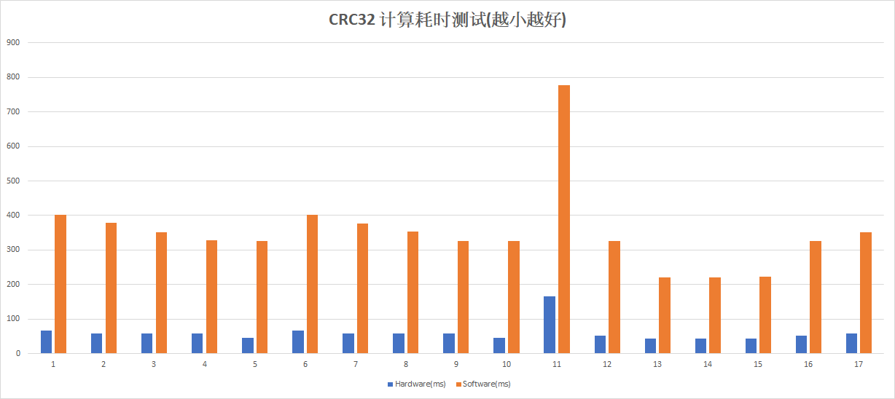

# CRC32 Hardware/Software Benchmark
		

| Hardware(ms)   |      Software(ms)      |  Build Option         |
|----------------|:----------------------:|----------------------:|
| 66	         | 403	                  | ARMCC 5.6  StdLib -O0 |
| 59	|378	|ARMCC 5.6  StdLib -O1|
| 59	|351	|ARMCC 5.6  StdLib -O2|
| 59	|328	|ARMCC 5.6  StdLib -O3|
| 46	|326	|ARMCC 5.6  StdLib -O3 -Otime|
| 66	|402	|ARMCC 5.6  MicroLib -O0|
| 59	|377	|ARMCC 5.6  MicroLib -O1|
| 59	|353	|ARMCC 5.6  MicroLib -O2|
| 59	|327	|ARMCC 5.6  MicroLib -O3|
| 46	|327	|ARMCC 5.6  MicroLib -O3 -Otime|
| 166	|778	|V6.16 -O0|
| 52	|326	|V6.16 -O1|
| 43	|221	|V6.16 -O2|
| 43	|221	|V6.16 -O3|
| 43	|222	|V6.16 -Ofast|
| 52	|326	|V6.17 -Obalanced|
| 58	|352	|V6.18 -Oimagesize|

